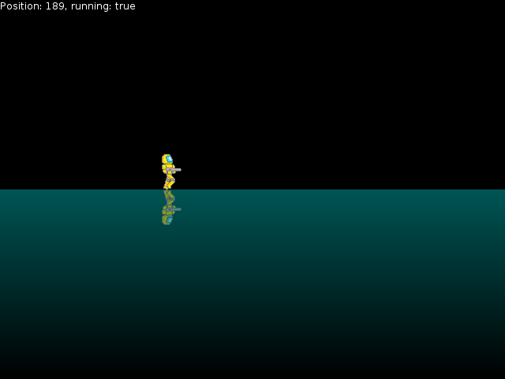

# libSDL2pp tutorial

[](https://travis-ci.org/libSDL2pp/libSDL2pp-tutorial)

---



Here's tutorial for [libSDL2pp](https://github.com/libSDL2pp/libSDL2pp),
C++11 bindings/wrapper for SDL2. It covers core functionality of
the library, including initialization and window construction,
loading image files, sprite and text rendering, animation, and event
handling trying to demonstate library features in as little code
as possible.

## Lessons

The tutorial is split into lessons, which demonstrate gradual
development of a simple application resembling a platformer game.

* **[lesson00](lesson00.cc)**: SDL library initialization, window creation, image loading and rendering
* **[lesson01](lesson01.cc)**: picking specific sprite from an image atlas
* **[lesson02](lesson02.cc)**: main loop, event processing
* **[lesson03](lesson03.cc)**: timing and animation
* **[lesson04](lesson04.cc)**: keyboard control
* **[lesson05](lesson05.cc)**: texture generation
* **[lesson06](lesson06.cc)**: alpha blending and color modulation
* **[lesson07](lesson07.cc)**: text rendering

Each lesson adds some lines to the code and, thus, functionality
to the application. You can explore these lessons sequentially
starting from the first one (in which you might find e.g. ```git
diff lesson00.cc lesson01.cc``` helpful to see what was added by
the next lesson), or just jump straight to the last one and see
all bits at once.

## Building

To build executables from these lessons, you need **cmake**, **SDL2**,
**SDL2_image** and **SDL2_ttf** libraries and corresponding development
files.

To build the tutorial, run

    cmake . && make

which will produce a set of binaries: lesson00 .. lesson07.

## Author

* [Dmitry Marakasov](https://github.com/AMDmi3) <amdmi3@amdmi3.ru>

## License

Lesson code is licensed under [CC0](COPYING). Bundled data files
have separate licenses, see COPYRIGHT files under data/.
